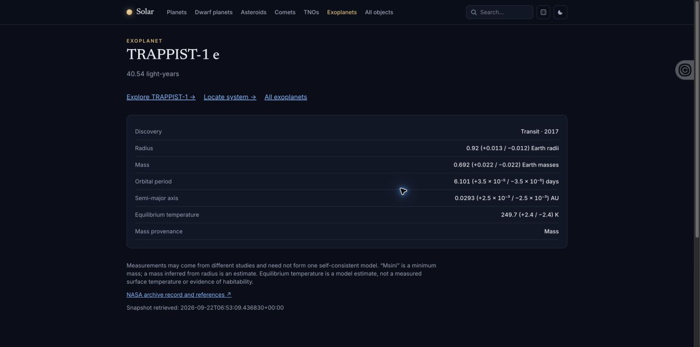
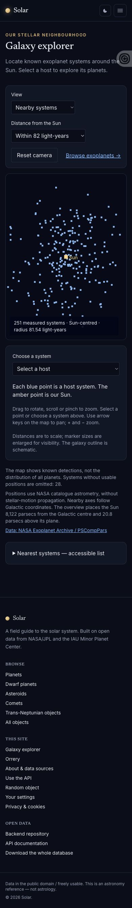

# Exoplanet browser verification — 24 September 2026

Local Chrome verification against the 22 September NASA snapshot, following
the merge of backend PR #30 and frontend PR #51. This is local acceptance
evidence, not verification of the production deployment.

Verified:

- Nearby map renders 251 systems within 25 parsecs, with the Sun marked.
- Switching to Milky Way overview renders 4,747 systems and the schematic
  galaxy outline, with Sun and Galactic centre labels.
- Searching for TRAPPIST-1 returns seven planets.
- Planet detail and host-system links open successfully.
- The host's map link selects TRAPPIST-1 and shows its seven planets and distance.
- The map, controls and system panel stack at a 390 × 844 viewport.
- Small orbital-period uncertainties remain visible in scientific notation.

Chrome's extension connection intermittently timed out; native accessibility
controls completed the desktop navigation checks. Mobile verification covers
layout only; touch gestures, point picking and keyboard camera controls have
not been exercised in this pass.

Galaxy explorer at phone width

