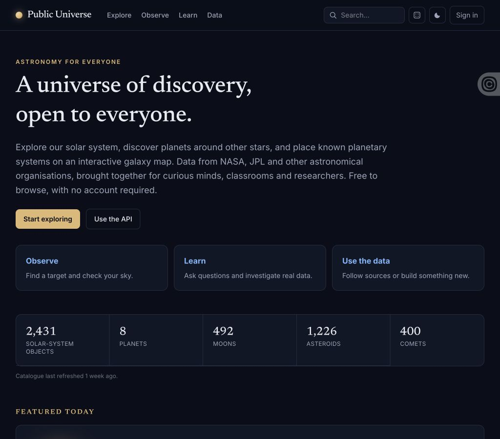
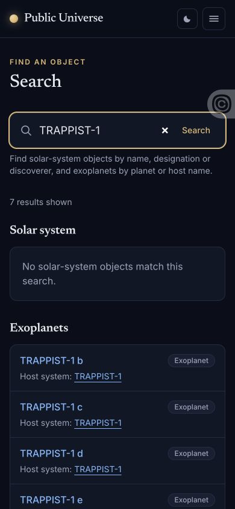

# Public Universe local acceptance — 1 October 2026

Development branch only. Chrome against loopback web `127.0.0.1:18011` and API
`127.0.0.1:18003`, using the retained September 22 exoplanet snapshot and a small
solar-system fixture. Screenshot counts are not production catalogue counts.
No scheduler, live email or third-party observing services were enabled.

## Verified

- Galaxy: 251 nearby measured hosts, 4,747 in the schematic Milky Way view.
- Focused canvas ArrowRight moved the rendered Sun label from 400px to 393px;
  `+` changed its projection to 391.6px and Reset camera restored 400px.
- Selecting TRAPPIST-1 showed seven planets, distance and uncertainty, with a
  working host link. Clicking an isolated plotted point selected GJ 9404.
  Dragging empty map space retained the selection. Overview switching worked.
- Unified search for TRAPPIST-1 showed seven planets with planet/host links
  and an honest empty solar-system group. Desktop and 390 × 844 layouts checked.
- Public Universe wordmark and four primary links fit at 1024px. The mobile
  menu at 390px exposed Explore, Observe, Learn and Data without clipping.
- Learn page: native detail disclosure opened with Enter; source links and
  filtered transit-discovery link are present. Guest hubs also have automated
  backend-outage coverage.
- Homepage reviewed at 1024 × 900 and 390 × 844. Viewport override reset.
- Asteroids: ID-ordered first page ended at Aten; Next began at Bacchus. Applying
  minimum diameter 10 km with NEO selected reset the cursor and returned four
  fixture matches. Reviewed the controls at 390px.
- Meteor list showed 44 parameter sets grouped into 25 showers; Geminids detail
  exposed all six sets, units, missing-value labels and Phaethon parent links.
  Detail reviewed at 390px. Upstream citation markup is displayed as escaped
  readable text; raw references remain available in data objects.
- Exoplanet export panel reviewed at 390px with CSV/JSON links carrying the
  TRAPPIST-1 filter. Separate local HTTP integration downloaded both formats:
  seven planets, matching source data, a metadata row in CSV, no-store and
  attachment headers, and an explicit absent immutable snapshot identifier.
- Invalid exoplanet URL `?q=true&distance=5` showed a distance error. Selecting
  a valid distance recovered to `?q=true&distance=10`, preserving the literal
  query and showing an honest empty result.

## Limitations

Physical touch rotate/pinch was not tested; mouse drag and responsive layout
do not certify touch behaviour. No production/domain cutover was performed.
Browser extensions emitted storage-access errors; map and navigation remained
functional. The screenshot may include extension UI.

The initial baseline had 216 PHP tests / 652 assertions, five JS tests and a
passing asset build. Post-change totals belong in the development progress log.

Additional evidence: [desktop search](search-desktop.png),
[mobile homepage](home-mobile.png), [mobile learning page](learn-mobile.png),
[asteroid filters](asteroids-mobile.png), [meteor detail](meteors-mobile.png),
[scientific exports](exports-mobile.png).

## Accessible measured-system directory follow-on

- `/systems` renders all 4,747 returned measured hosts across 198 pages in the
  retained local snapshot; coverage also reports 28 hosts without positions.
- A native form search for TRAPPIST-1 yielded one host and seven recorded planets.
  Cards show parsec distance/uncertainties and a light-year equivalent.
- Name-sort page 2 began with 4 UMa, 47 UMa and 51 Eri; Next retained `order=name`
  and moved to page 3 beginning BD+05 4868 A, BD+14 4559 and BD+15 2375.
- The explanatory native disclosure opened with Enter. On mobile (390×844),
  labels, inputs, buttons, scientific errors and host links fit the viewport.
- Proxima's map link selected Proxima with two recorded planets and preserved
  tiny upper/lower errors (+1.109E-3 / −1.142E-3 light-years), instead of zero.
- Browser JS remained enabled. Ordinary-GET feature tests exercise results,
  filtering, sorting, pagination and recovery without a JavaScript runtime;
  forms/links contain no required Livewire actions. Physical-device limitations
  above still apply. Viewport override was reset.

Evidence: [desktop directory](systems-desktop.png),
[mobile controls](systems-mobile.png), [mobile result](systems-mobile-result.png).
