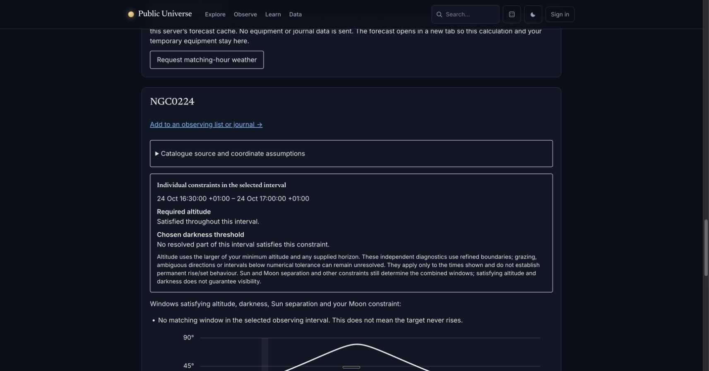
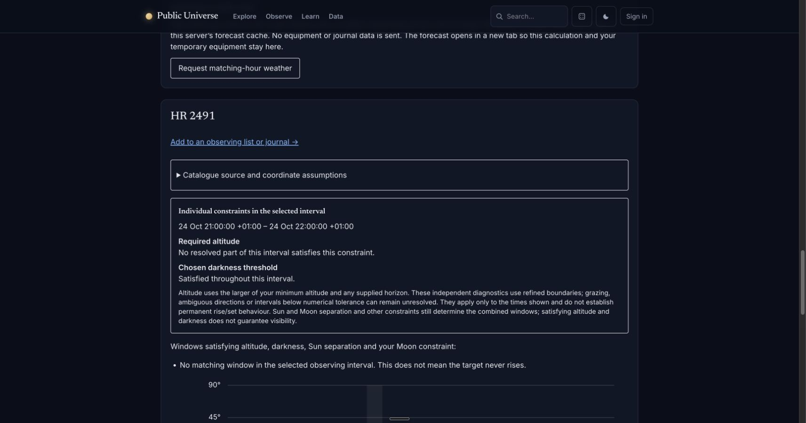

# Refined constraint explanations in Chrome

Native Chrome checks on 2 October 2026 against combined web `c36de8a`, local
server `18026`, and stable backend `2dfc478` on `18010`. Calculations used the
checksum-pinned JPL DE440s provider and synthetic London coordinates 51.5, −0.12,
Europe/London, 2026-10-24. The local night correctly spans 25 hours over the
clock change. Minimum altitude was 20°, darkness threshold −12°, Moon separation
0°, no horizon mask, and no weather request.

- M31 (`openngc:NGC0224`), UTC 15:30–16:00: altitude satisfied throughout the
  selected interval; no resolved part satisfied darkness. No combined window.
- M31, UTC 20:00–21:00: both requirements satisfied throughout, with the full
  one-hour combined window. The displayed interval was 21:00–22:00 +01:00.
- Sirius (`bsc5p:hr2491`), UTC 20:00–21:00: no resolved part satisfied altitude;
  darkness satisfied throughout. No combined window. The target edit was
  explicitly verified in the native form before submission.

The explanations scoped themselves to the selected interval, distinguished the
independent constraints from combined windows and did not claim permanent
rise/set behaviour. Inputs remained in a private POST; the result URL contained
no coordinates. Screenshots were inspected and retained:

## Verification and remaining limits

At `c36de8a`, the combined branch passed 1,327 PHP tests / 5,924 assertions with
inherited `APP_DEBUG=true`, 247 JavaScript tests, Pint, PHPStan and the production
build. The build retains its existing large optional map-chunk warning; asset
budgets remain independently enforced. Independent reviewers checked the new
consumer and export behaviour, including inconsistent partial-darkness input.

A final native Print this session attempt timed out in browser control; available
native app inspection did not expose that browser instance's print dialog. No
print job was submitted. Escape returned control to the ordinary page. The
current revision's printed appearance/privacy is **not verified** by this attempt;
the earlier three-page preview remains evidence only for its recorded revision.

A separate reviewer repeated one scoped attempt against the same current local
runtime: M31, UTC 20:00–21:00, with an explicit two-point terrain profile. The
calculation and both throughout-interval diagnostics appeared, but Print again
timed out and native Chrome inspection exposed an unrelated window. The reviewer
stopped without acting on that window. This reproduces the preview-observation
limitation; it supplies no new print artifact or permission to change browser
settings.

A fresh Download session JSON event wait also timed out. This does not prove
download success or failure, and no artifact from that attempt is certified.
The current JSON retention/redaction tests pass; earlier inspected native
downloads remain scoped to their recorded revisions. These timeouts are separate
from the previously reported file-import permission and exoplanet attachment
restrictions; no restriction was changed or bypassed.
