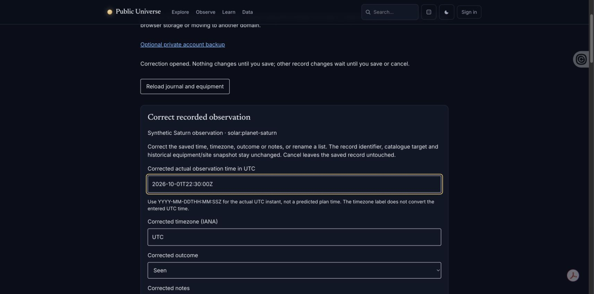

# Guest journal correction acceptance

2 October 2026; isolated local checkout based on `e39df13`, browser origin
`http://127.0.0.1:18020`. Chrome desktop, normal viewport; no physical/mobile
acceptance is claimed. Only newly entered synthetic list/observation records were
used. No real account, location, equipment profile or remote API data was needed.

Confirmed through visible browser controls:

- Created a synthetic list, opened Rename, saved a new name and verified focus
  returned to its updated action button.
- Created a clearly labelled synthetic Saturn observation; opening Correct
  prefilled its original time, timezone, outcome and notes.
- Entered 30 February: the exact-date error appeared while saved history and
  pending correction remained visible. Reload during correction was refused.
- Corrected the UTC instant, outcome and notes; saved record updated and focus
  returned to its new timestamp-labelled correction button.
- Undo followed by a full page reload restored the original recorded time,
  outcome and notes. Rebuilt assets were reloaded before final visual inspection.

The screenshot includes browser-extension overlays; these are not application
features. Default theme and other native/browser preferences were not changed.

Automated acceptance: 39 journal UI/store tests cover historical snapshots,
stable identity, validation, quota and stale-tab failures, original-data recovery,
import races and exact same-DOM Back/Forward-cache remount. Full PHP suite passed
955 tests / 3,777 assertions. The complete JavaScript suite passed all 210 tests, including the final
same-DOM remount regression. Pint, PHPStan and production build passed.

Corrupt-store downloads were verified through a mocked Blob/download boundary,
including exact unpaired UTF-16 preservation; no native Save dialog or real
file-input import was exercised in this slice. Physical touch, screen-reader
speech and simulated storage quota in Chrome remain outside this acceptance.
