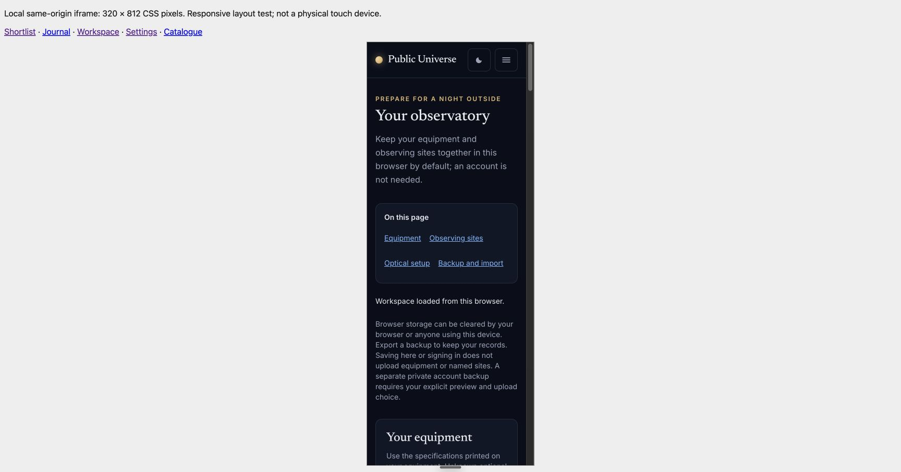
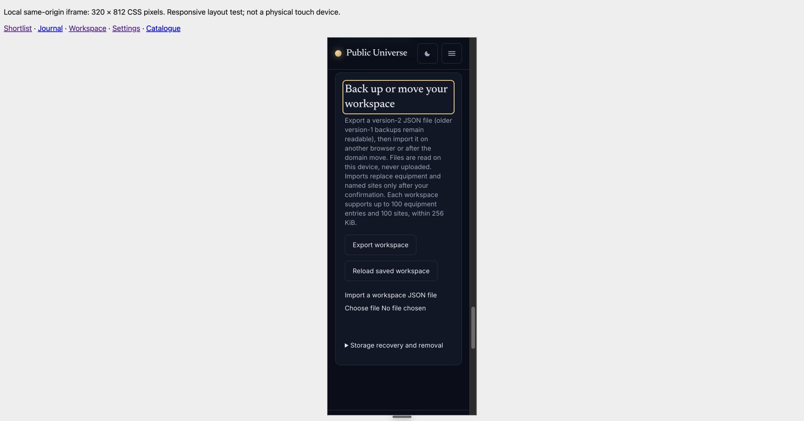

# Native section navigation acceptance

Integration `6c079c3` adds shared native anchor navigation to the observatory,
journal and planner. It introduces no JavaScript or additional sticky overlay;
headings receive `tabindex=-1`, existing 6rem fragment spacing applies, and the
menu is hidden in print. Planner links only name sections actually rendered.

The author ran 97 relevant PHP tests /528 assertions, Pint, PHPStan and build.
An independent reviewer found no actionable issue; five dedicated navigation
tests /101 assertions also passed independently and again on the root integration.
They cover unique focusable destinations and initial, success, validation-error
and unavailable-provider responses.

Native Chrome at local `18026` verified the journal menu and keyboard Enter on
Backup and import: focus moved to `journal-backup-heading`, the URL gained only
that fragment, the heading remained visible below the header, and the document
had no horizontal overflow at 1728 CSS pixels. A fresh planner form exposed only
Location, time and targets, without links to absent results.

The same-origin 320 × 812 iframe harness on `18024` served the same integration
checkout for a narrow observatory check. Its menu measured 273 CSS pixels wide,
with four wrapping links, each 44 pixels high. Enter on Backup and import focused
`workspace-backup-heading`; the inspected screenshot shows the complete heading
below the fixed site header with a visible focus outline. This is actual desktop
layout/keyboard evidence, not a physical touch-device or low-power measurement.

