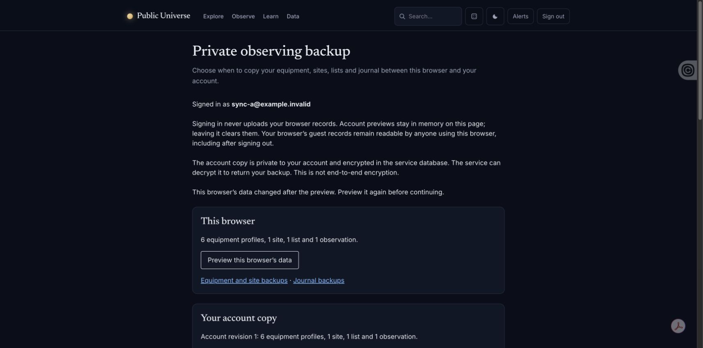
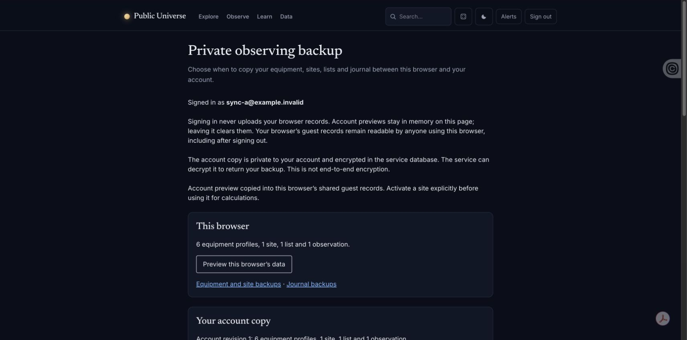

# Private-backup account and concurrent-tab acceptance

Actual Chrome extension/CUA checks on 2 October 2026, using source
`f81d8ccc03cdc727b9e1852eb5d19ddb3af7b2c9` and a production Vite build on
loopback port18093. This extends the earlier single-account
[backup acceptance](../../2026-10-01/observing/README.md).

The separate worktree had its own disposable SQLite database, application key,
file sessions and uniquely named session cookie. Two factory-created, verified
`example.invalid` accounts had distinct encrypted revision1 copies derived from
`tests/fixtures/observing-sync/payload.json`, validated by `SyncPayload`. A held
six equipment profiles, one site, one list and one clearly synthetic observation;
B held six profiles, one site, two lists and no observations. No real credentials,
account records or observations were used. Outgoing astronomy HTTP was replaced
by an unavailable fixture and mail was faked. Existing port18016 was untouched.

All actions below used native page controls in two same-origin tabs, with no
browser JavaScript/storage/network injection:

| Check | Observed result |
| --- | --- |
| Initial preview and restore | A showed empty browser records and account revision1 until explicit actions. Consent and restore copied the synthetic profiles/list/observation into guest storage. |
| Account switch with an old page | Signing out A and into B in tab2 left tab1's original page open. Its next account check said the signed-in account changed, cleared the account preview and all consent boxes, and disabled upload/restore. A fresh B page showed B's original revision1/two lists/zero observations. |
| Shared guest state | Signing into B did not upload or replace A's restored browser records. The page explicitly describes shared guest storage; this is not a claim of separate per-account localStorage. |
| Stale server revision and deletion | Both B tabs previewed revision1. Tab1 deleted the synthetic copy, producing revision2/deleted. Tab2's old revision1 upload received a changed-elsewhere message and lost its account preview. An explicit fresh check still showed revision2/deleted; no automatic retry resurrected the copy. |
| Stale browser preview | While A's backup page held a guest preview, tab2 created a list through the journal form. Restore refused because browser data changed. Reloading the journal showed the newer list remained. |
| Deliberate recovery | Refreshing the browser preview, consenting again and restoring A succeeded. The journal returned to A's original list/observation; account revision1 stayed unchanged. The restored site still offered Use, rather than being activated. |

The stale-guest case was repeated to capture its readable refusal message after
scrolling to the top status/alert region. This second refusal intentionally left
the newer synthetic guest list intact. The test session was signed out, and both
owned browser tabs were closed. No viewport override was used.

## Automated evidence and remaining limits

Focused checks on the same source passed **43 PHP tests / 347 assertions** and
**26 Node22 tests**: the ObservingSync feature/page/Unicode and SyncPayload suites,
plus `observing-sync.test.js` and `sync-schema.test.js`. Local HTTP login and
read-only copy checks for both accounts returned private/no-store and no-referrer
headers. Independent locked dependency installation and production build passed.

Selective second-key quota failure, failed rollback and the interleaved-write
recovery branch remain **automated-only** evidence. The native UI does not offer
a reliable way to induce them, and storage-method injection was not used.
LocalStorage has no atomic multi-key compare-and-swap: another writer can still
act between a check and a write. These browser checks do not remove that documented
limitation. See [the sync contract](../../../observing-sync.md).

This pass used desktop Chrome. It does not claim physical touch-device testing,
screen-reader announcement validation, production-database concurrency, or a live
service deployment. Status and error messages are in the existing top-of-page
live regions; the screenshots scroll there after the action. Earlier mobile
backup controls are documented separately in the first acceptance record.
