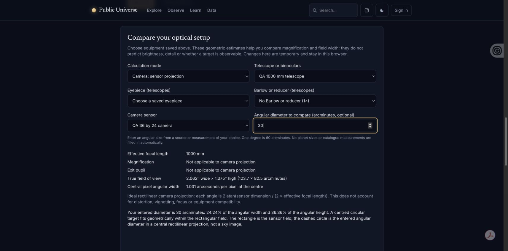
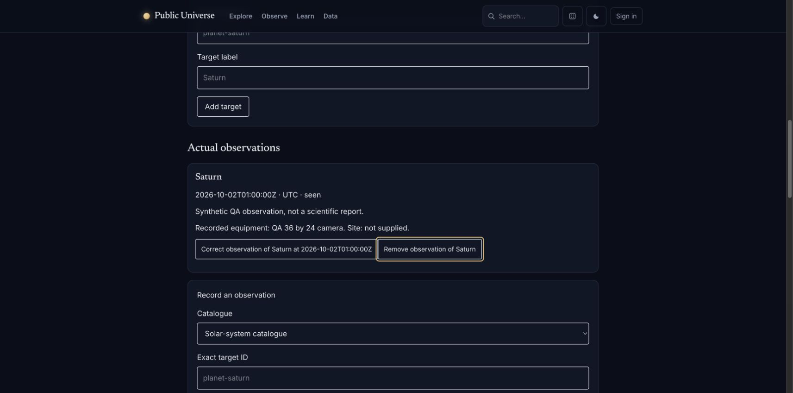
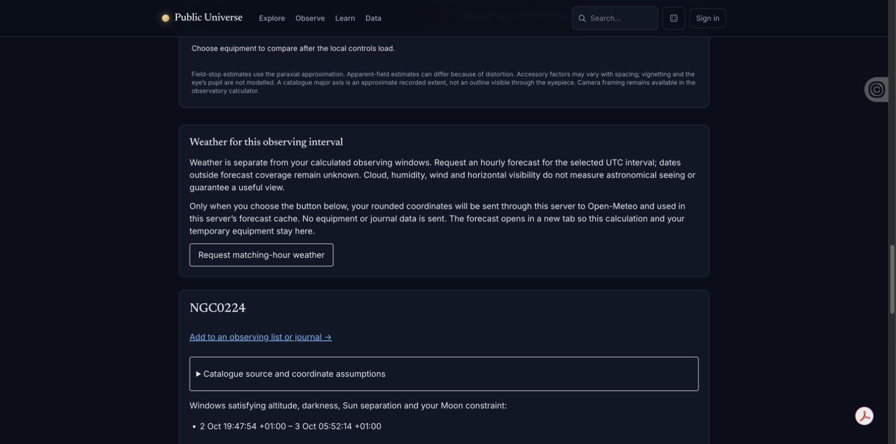

# Camera, journal and script-blocked native acceptance

Actual Chrome checks on 2026-10-02, using Computer Use and synthetic records only.
Workspace/journal source: `96c9416` (includes `44b66f4`), production-built assets,
isolated loopback web server `18021`. No production services, account data, actual
observer location, device permissions or browser preference changes were used.

## Camera and journal

- Created a telescope with 200 mm aperture and 1000 mm focal length and a camera
  with a 36 × 24 mm sensor. Leaving pixel size blank saved an explicit unknown;
  the camera field remained calculable while pixel angular width stayed unknown.
- Reload preserved both records, while temporary calculator selections reset.
- Edited the camera to 5 µm pixels. Camera mode showed 2.062° × 1.375°
  (123.7 × 82.5 arcminutes) and 1.031 arcseconds per central pixel. An entered
  30-arcminute diameter showed 24.24% of angular width and 36.36% of height, with
  the geometric-fit and non-image limitations visible.
- Created a synthetic Saturn observation at `2026-10-02T01:00:00Z`, with the saved
  camera snapshot. Keyboard Enter opened correction and saved changed notes and
  an uncertain outcome. Undo restored the original seen outcome and notes;
  reload retained that restored observation and its recorded camera.
- The workspace lead now describes browser-local saving by default and the
  separate explicit private-account backup choice. Signing in does not upload.

## Native planner with page scripts blocked

The parent QA server `18022` served the current integration with response CSP
`sandbox allow-forms allow-same-origin allow-popups`, omitting `allow-scripts`.
This is evidence for blocked page scripts, **not** a test of the HTML parser's
`noscript` path or a globally disabled JavaScript browser setting.

Using native accessibility controls, submitted a target-only NGC0224 link with
synthetic London coordinates (51.5, −0.12), Europe/London and 2026-10-02. The native
POST completed against the local JPL backend, returned the 24-hour night and the
19:47:54–05:52:14 +01:00 geometric window, and kept coordinates out of the URL.
Native disclosure expanded the numeric sample table. Equipment comparison
controls remained disabled with their JavaScript explanation; session downloads
were replaced by the browser-print explanation. No weather request was made.

## Limits

The browser viewport capability accepted a temporary 320 × 812 request, but both
the existing tab and a new tab still reported a 1713 CSS-pixel document viewport
and screenshots remained desktop width. The override was reset. These captures
therefore do **not** establish 320-pixel journal or camera acceptance. Physical
touch, screen-reader interaction and device/GPU performance are not established
by these checks. Native import remains separately pending the browser's file
permission boundary; no permission was changed or bypassed here.
