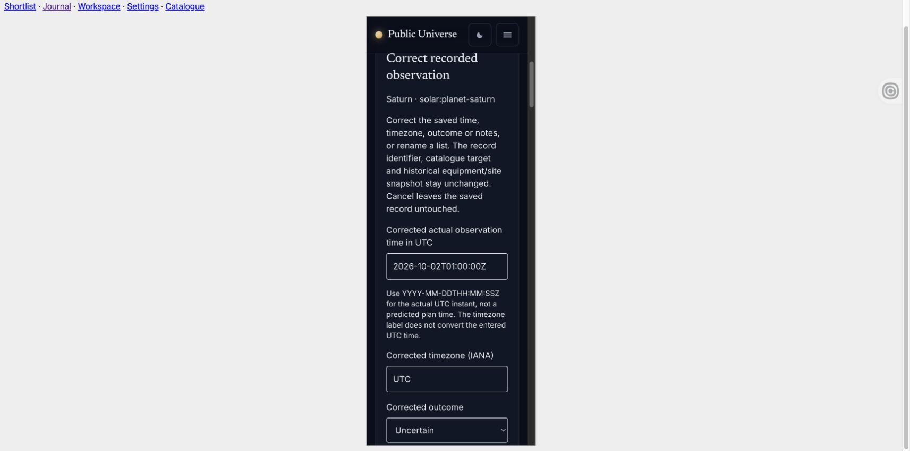
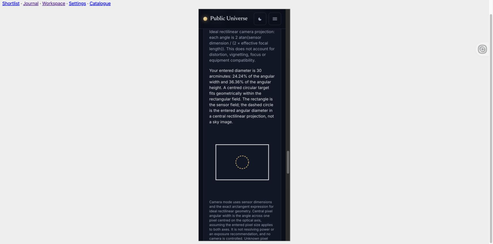
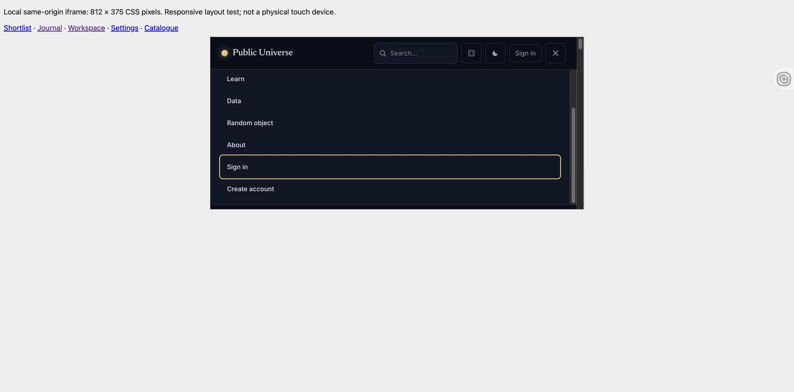
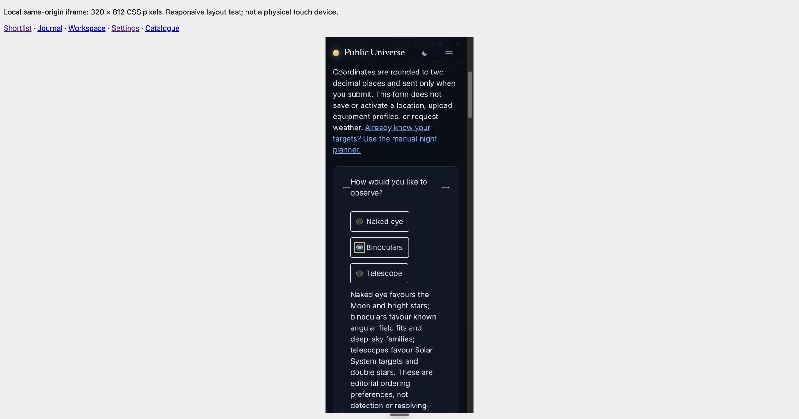
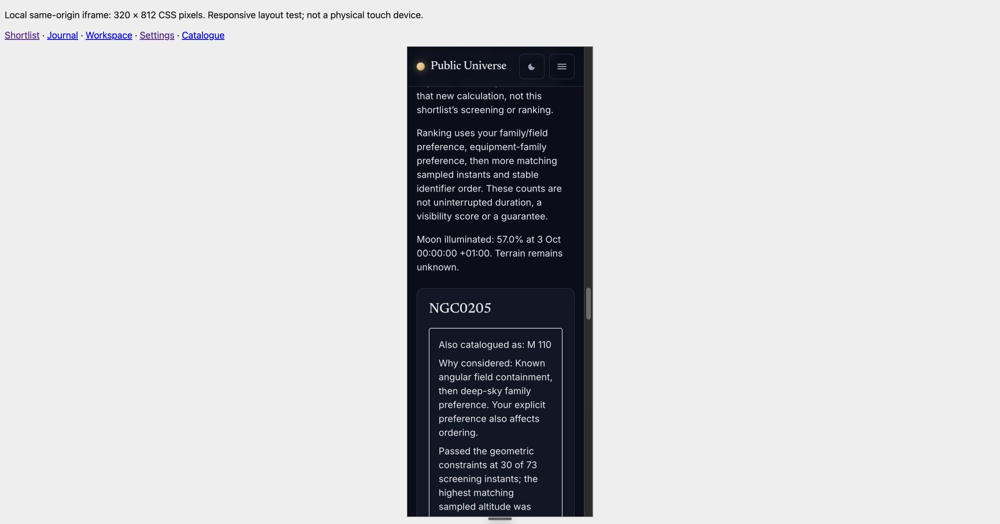
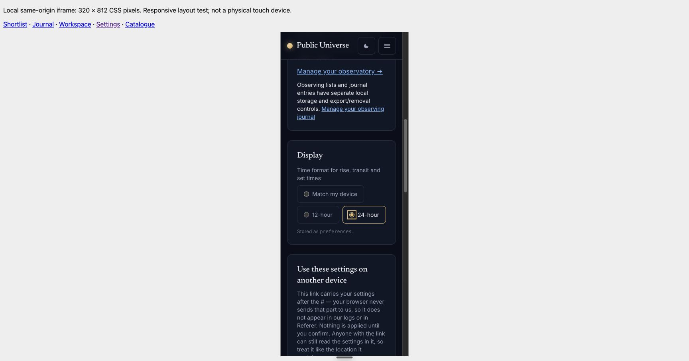
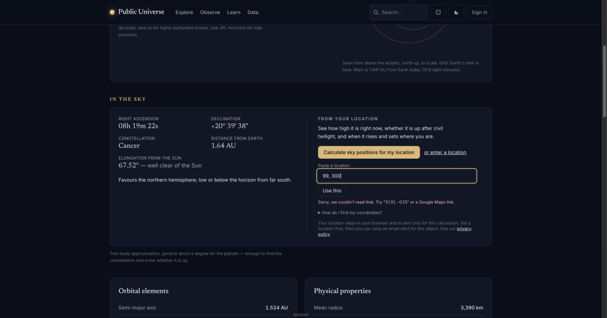

# Camera, journal and script-blocked native acceptance

Actual Chrome checks on 2026-10-02, using Computer Use and synthetic records only.
Workspace/journal source: `96c9416` (includes `44b66f4`), production-built assets,
isolated loopback web server `18021`. No production services, account data, actual
observer location, device permissions or browser preference changes were used.

## Camera and journal

- Created a telescope with 200 mm aperture and 1000 mm focal length and a camera
  with a 36 × 24 mm sensor. Leaving pixel size blank saved an explicit unknown;
  the camera field remained calculable while pixel angular width stayed unknown.
- Reload preserved both records, while temporary calculator selections reset.
- Edited the camera to 5 µm pixels. Camera mode showed 2.062° × 1.375°
  (123.7 × 82.5 arcminutes) and 1.031 arcseconds per central pixel. An entered
  30-arcminute diameter showed 24.24% of angular width and 36.36% of height, with
  the geometric-fit and non-image limitations visible.
- Created a synthetic Saturn observation at `2026-10-02T01:00:00Z`, with the saved
  camera snapshot. Keyboard Enter opened correction and saved changed notes and
  an uncertain outcome. Undo restored the original seen outcome and notes;
  reload retained that restored observation and its recorded camera.
- The workspace lead now describes browser-local saving by default and the
  separate explicit private-account backup choice. Signing in does not upload.

## Native planner with page scripts blocked

The parent QA server `18022` served a moving integration checkout
(`52aae2f` through `f81d8cc`; no per-request revision pin was retained), against
the stable local backend `17583c9`, with response CSP
`sandbox allow-forms allow-same-origin allow-popups`, omitting `allow-scripts`.
This is evidence for blocked page scripts, **not** a test of the HTML parser's
`noscript` path or a globally disabled JavaScript browser setting.

Using native accessibility controls, submitted a target-only NGC0224 link with
synthetic London coordinates (51.5, −0.12), Europe/London and 2026-10-02. The native
POST completed against the local JPL backend, returned the 24-hour night and the
19:47:54–05:52:14 +01:00 geometric window, and kept coordinates out of the URL.
Native disclosure expanded the numeric sample table. Equipment comparison
controls remained disabled with their JavaScript explanation; session downloads
were replaced by the browser-print explanation. No weather request was made.

## Narrow and short landscape acceptance

After the ineffective viewport override below, the parent created a disposable
same-origin local HTML iframe harness on `18024`, serving its moving integration
checkout (`f81d8cc` through `c060a34`). Application behavior stayed at `f81d8cc`,
with the journal's browser-local-by-default copy refined in `ee8a2ea`;
the intervening changes were documentation. This tests real document layout and media queries without altering
browser preferences; it does not emulate physical touch or a mobile device.

- `/__qa/narrow` gave the iframe a 320 × 812 CSS-pixel content box. Its document
  client width was 305 pixels because of the 15-pixel vertical scrollbar.
  Both the journal and camera page reported `scrollWidth === clientWidth === 305`.
- Created a synthetic Saturn observation, opened correction with Enter, changed
  notes and outcome, saved, and used Undo to recover the original seen outcome
  and notes. Renamed a list; subsequent navigation retained the renamed list and
  restored observation. Editor labels, UTC input and controls wrapped readably.
- Created telescope and camera profiles through the narrow equipment form,
  leaving pixel size unknown. The 36 × 24 mm / 1000 mm calculation returned the
  same 2.062° × 1.375° field, explicitly unknown pixel angle, and the correct
  30-arcminute comparison. Text and rectangular diagram stayed within the page.
- `/__qa/landscape` used an 812 × 375 box (797-pixel document client width with
  scrollbar), again without horizontal document overflow. The menu opened with
  Enter, scrolled to lower account links as keyboard focus moved, and Escape
  collapsed it and returned focus to the Menu button.

## Shortlist, settings and observer keyboard follow-up

The parent repeated native Chrome checks against integration `a2242b9` (same
application behavior as `f81d8cc` plus journal copy), backend `a4ef9bb`, on the
320 × 812 same-origin frame at `18024`. The shortlist form and returned result
both measured `scrollWidth === clientWidth === 305`.

- Arrow Right moved equipment choice and focus from Naked eye to Binoculars.
- A native POST for synthetic London (51.5, −0.12), Europe/London, 2026-10-02,
  binoculars and one candidate returned NGC0205/M110. Its refined window was
  19:47:54–05:52:14 +01:00. No true field was supplied, and unknown containment
  remained explicit. Explanation, brightness and sampling limits wrapped.
- The numerical disclosure opened and its region received keyboard focus.
  Arrow Right moved `scrollLeft` to 7.5 pixels within a 231-pixel region containing
  a 624-pixel table; the document retained its 305-pixel width.
- Settings radio keys moved Match my device → 12-hour → 24-hour, retaining visible
  focus and updating the locally generated settings link.
- On the desktop Mars page at `18023`, submitting synthetic invalid `99, 300`
  with Enter retained focus in Paste a location. The input had `aria-invalid=true`
  and `aria-describedby=observer-text-error`. This exposed a misleading
  what3words suggestion while that integration was disabled. The follow-up
  correction conditions the suggestion on availability; native resubmission
  confirmed the corrected text and retained focus. Its 26 PHP tests / 118
  assertions passed, including both enabled/disabled hints and no outbound call
  for invalid coordinates.

## Limits

The browser viewport capability accepted a temporary 320 × 812 request, but both
the existing tab and a new tab still reported a 1713 CSS-pixel document viewport
and screenshots remained desktop width. The override was reset. The first three
captures therefore establish desktop/script-blocked behavior; the separate
iframe checks above establish narrow-layout behavior. Physical
touch, screen-reader interaction and device/GPU performance are not established
by these checks. Native import remains separately pending the browser's file
permission boundary; no permission was changed or bypassed here.

## User-assisted native file import

The user selected the unchanged synthetic `tests/fixtures/observing/workspace-v2.json`
(copied to Downloads as `public-universe-import-test.json`) through the native
file picker on `http://127.0.0.1:18026/observatory`, then completed confirmation
before the agent inspected the preview. The workspace was visibly empty before
this operation. No extension permissions or browser security settings changed.

Native page inspection showed all six equipment records with their expected
specifications, plus Example London site (51.51, −0.13, Europe/London, 20°
minimum altitude and four horizon points). A full page reload preserved those
records and specifications. The imported site remained available to activate
explicitly; this check did not activate it.

This establishes successful native v2 workspace import and persistence. The
transient preview and confirmation text were not observed by the agent during
this manually completed attempt, and export roundtrip remains a separate check.
Journal import and older-version migration are not established by this result.

Fixture SHA-256: `576944c372bfd8b9f7767d5935cfbdd938f3d24a4340fb3f8807bfbd7f23908f`.

The user then clicked Export workspace and saved
`public-universe-workspace-v2.json` to Downloads. The 1107-byte artifact parses
to a document **exactly equal** to the original v2 fixture: all IDs, six equipment
specifications, optional nulls, one site's coordinates/timezone/minimum altitude,
four horizon points and `activeSiteId=null` survive import, reload and export.
Only serialization formatting may differ. Artifact SHA-256:
`fbcbe4462ab98c227dcf2442d719e09da9956c6e6c58358f1c3d8d680032e425`. This closes the native
v2 workspace roundtrip check for these synthetic records.

## User-assisted journal import

The user selected `public-universe-journal-test.json` through the native file
picker on local `/observing-journal` and completed the replacement. The journal
was visibly empty beforehand. The fixture was built and validated with the
application's `snapshotSetup`/`validateJournal` functions, containing one QA list
and one explicitly synthetic Saturn observation with telescope, camera and
example-site history. Fixture SHA-256:
`9684e355d2689931d28ca9023bfeb043b640599647f242259bb974a3fe871333`.

Native inspection showed Saved in this browser, the QA October test list, Saturn's
planned list status, observation UTC time `2026-10-01T22:30:00Z`, Europe/London,
uncertain outcome, exact synthetic note and recorded telescope/camera/site names.
All remained after a full page reload. The preview was completed before agent
inspection, so this establishes import and persistence rather than independent
visual review of that transient preview. No browser permission changes occurred.

The user exported journal JSON first with site inclusion unchecked, then checked.
`public-universe-journal-v1.json` (882 bytes, SHA-256
`e9d71e28e41cdf852b226d3f2db2cd13cfe3c5882eb6114467c10a4187a29a86`)
is exactly equal to the original fixture after removing its site snapshot and
clearing the snapshot's active site. Lists, observation, notes and equipment
remain unchanged. `public-universe-journal-v1 (1).json` (1,240 bytes, SHA-256
`c1c443a33f22f4675e7e3efb436c7d5af67b7b408052a9a2bdc413b21e8848b2`)
is exactly equal to the full original parsed fixture, including the historical
site and four terrain points. This establishes the native journal import/reload/
export roundtrip and both privacy modes for these synthetic records.
